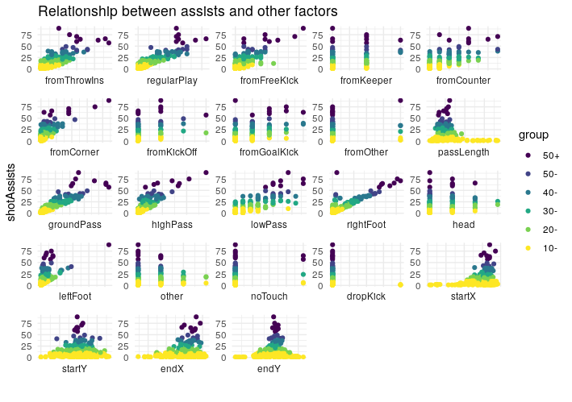
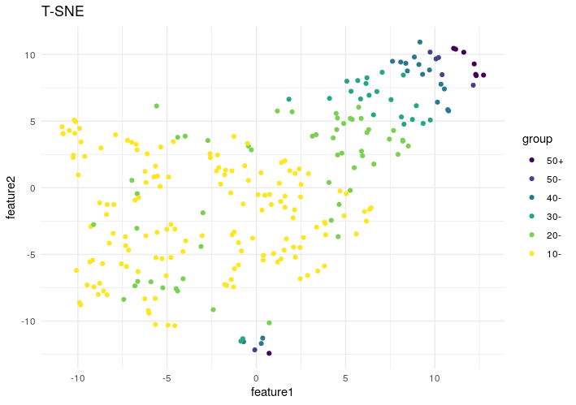
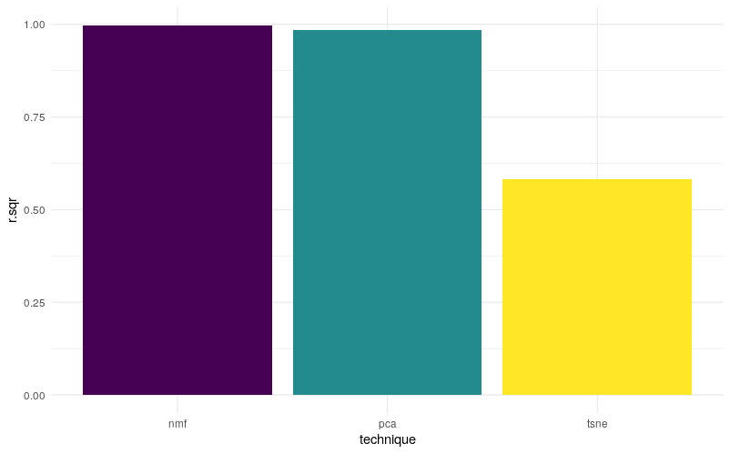

# AssistsAnalysis

In soccer, the most valuable players are those who score the most goals. However, goalscorers on their own can't do much, they need someone to provide them the ball so they can score. In this analysis I'll look at those providers, the playmakers. It could be argued that assisting is harder than scoring, since it involves picking out a player who has abundant space, while also deciding whether the receiver wants the ball at his feet or ahead of him (if he is making a run behind defense), and doing all of this while under pressure from the opponent's defenders.

I'll be using data from the English Women Super League (FAWSL), provided by statsbomb (https://statsbomb.com/), which provides event tracking data, including pass specific information such as the start and end locations of a pass, the height of a pass, etc... Statsbomb has opensourced the data for both the 2018/19 & 2019/20 seasons. 

During this period, there have been 383 assisted goals, and the top five assist providers are:

Vivianne Miedema - Arsenal: 18


Bethany Mead - Arsenal: 14


Caroline Weir - Manchester City: 10


Danielle van de Donk - Arsenal: 10


Keira Walsh - Manchester City: 10


Incidently, these are the only players with double digits assist totals during the covered time span. So what exactly do these players do that makes them more productive? It can be that they start their passes from specific positions on the pitch (this will correspond to the startX variable in our dataset), or it could be that they pick certain locations to pass to (corresponding to the endX variable in our dataset). It could also be that their passes have a specific length, or it could be that they are dead ball specialists with the ability to pick unmarked colleagues from set pieces. Or, it could be a combination of all of these features. This is why I will be using 3 dimesion reduction techniques, T-SNE, PCA, and NMF, to try to distill as much information as possible from the different features into 2 features.


## Features

Our dataset has 255 players, with 23 dimesions describing different aspects of passes for each. The values for these features are either total count or average. For example, the 'fromThrowins' feature, which tells how many shot assists were provided by a give player from a throw in situation is aggregated by count, while 'passLength' is aggregated by average - the average pass length for a given player. As a result of such aggregation, there will be no categorical variables included in our dataset. Here is a snapshot of the dataset:


A quick word about the target variable here: I'll be using shot assists as my target value instead of goal assists. There are 2 reason why I'm doing this: 1- To have a larger dataset; soccer is a low scoring sport, so we have far fewer assisted goals (383) than assisted shots (3426), 2- I'm analyzing playmaking ability not goal scoring ability; a good playmaker should be judged by the quality of her passes, what happens after that in terms of converting a pass into a goal shouldn't have a bearing on our judgement. It should also be mentioned that there is a linear relationship between assisted goals and assisted shots, as illusted by the below plot, so assisted shots can be considered as a good proxy for assisted goals:


Another thing that I need to clarify here is the 'group' label: I'm grouping players by the total number of shot assists they contributed during the 2 seasons in order to have a categorical identifier instead of a continuous one. As seen, the best playmakers are those who have provided 50+ assisted shots, and considering the fact that each team plays 20 matches per season, and that the 2019/20 season was interrupted after 15 matchdays due to the COVID-19 outbreak, we can say that elite playmakers are those who provide 1.5-2 shot assists per game (50+ divided by 35). The top assist providers mentioned above have the following shot assist figures:

1- Vivianne Miedema: 63 (average\* 1.8)  
2- Bethany Mead: 75 (average 2.14)  
3- Caroline Weir: 89 (average 2.54)  
4- Danielle van de Donk: 57 (average 1.63)  
5- Keira Walsh: 39 (average 1.11)\*\*  

\* The average values here assume that the player has participated in all 35 matches played.  
\*\* Keira Walsh's average is lower than expected; this could be justified as being an outlier or by the fact that she plays for one the better teams in the league and is surrounded by talented players who are more efficient at scoring 

Here is a table showing counts per each group:


Now, let's examine the relationships between shot assists (target) and the different features (predictors):



Each one of these plots shows a relationship between shot assists and a particular feature. As seen here, some features have a linear relationship with the target variable (such as regularPlay & rightFoot), and thus might have more predictive power. Also, some of these relationships have a similar shape, an indication of a strong correlation among the predictor variables. The below correlation plot corroborates this:  


This is another reason why we should use dimension reduction, since a model relying on more predictors is more prone to overfitting.

## Dimensionality Reduction

### 1- T-SNE

I start with the T-SNE technique. Here is the result:



### 2- PCA

Next, I look at PCA. Here is the result:


### 3- Non-negative Matrix Factorization

Finally, non-negative matrix factorization. Here is the result:


### Conclusion
**From these plots we can conclude the that:**

* **t-SNE: The 10- & 20- groups are mixed together, as well as some of the points at the lower end of the feature2 axis, indicating that the t-SNE reduced features do not provide a good picture of our data**
* **PCA: Provides a better picture than t-SNE, yet we can still identify a few mixed points, especially among the 10- & 20- groups**
* **NMF: Provies the best picture of our data, with clear distinction among the 6 groups**  

**Another way to compare the three techniques is to use their respective outputs to build a simple linear regression model to predict the number of shot assists, and compare the performance of the three models. The below figure shows the R-Squared values of the three models:**



**As shown, the model created using the NMF features has the highest R-Squared value, followed by PCA, and the lowest is t-SNE. This is further evidence that NMF is the best dimensionality reduction technique for our data.**


##Appendix I - Code

```
# libraries
library(StatsBombR)
library(dplyr)
library(ggplot2)

################################################################################## RETRIEVING DATA
# getAssists: function to retrieve the dataset - when fromSource is set to FALSE, the function reads the data from the file
# totalXA.csv

getAssists <- function(fromSource=FALSE){
  if (fromSource){
    Comp <- FreeCompetitions()
    Matches <- FreeMatches(Comp)
    FAWSL <- filter(Matches, competition.competition_name == 'FA Women\'s Super League')
    
    # find common columns
    col_counter <- data.frame(x=character(0), y=numeric(0), stringsAsFactors=FALSE)
    colnames(col_counter) <- c('colname', 'colcount')
    `%notin%` <- Negate(`%in%`)
    
    for (i in FAWSL$match_id){
      print(i)
      colz <- c(colnames(get.matchFree(filter(FAWSL, match_id == i))))
      for (j in 1:length(colz)){
        if(colz[j] %notin% col_counter$colname){
          col_counter[nrow(col_counter) + 1,] = list(colz[j], 1)
        } else {
          col_counter$colcount[col_counter$colname == colz[j]] <- col_counter$colcount[col_counter$colname == colz[j]]+1
        }
      }
    }
    
    # get match events
    colkeys <- col_counter$colname[col_counter$colcount == 194]
    
    FAWSLEvents <- data.frame()
    for (i in FAWSL$match_id){
      print(i)
      event <- select(get.matchFree(filter(FAWSL, match_id == i)), all_of(colkeys))
      event$match_name <- paste(filter(FAWSL, match_id == i)$home_team.home_team_name,
                                'v',
                                filter(FAWSL, match_id == i)$away_team.away_team_name) 
      event$match_date <- filter(FAWSL, match_id == i)$match_date
      FAWSLEvents <- rbind(FAWSLEvents, event)
    }
    
    # get assisted shots
    FAWSLEvents$xA <- NA
    FAWSLXG <- FAWSLEvents[!is.na(FAWSLEvents$shot.key_pass_id),c('shot.key_pass_id','shot.statsbomb_xg')]
    FAWSLEvents[FAWSLEvents$id %in% FAWSLXG$shot.key_pass_id,'xA'] <- cbind(FAWSLEvents[FAWSLEvents$id %in% FAWSLXG$shot.key_pass_id,c('xA','id')],FAWSLXG)[,'shot.statsbomb_xg']
    xADataset_M <- FAWSLEvents[!is.na(FAWSLEvents$xA),]
    xADataset_M <- select(xADataset_M,
                          id,
                          player.name,
                          xA,                      
                          location,
                          play_pattern.name,
                          starts_with('pass'),
                          -pass.assisted_shot_id,
                          -pass.shot_assist,
                          -pass.recipient.id,
                          -pass.recipient.name,
                          -pass.height.id,
                          -pass.type.id,
                          -pass.body_part.id,
                          -pass.outcome.id,
                          -pass.cross,
                          -pass.switch,
                          -pass.type.name,
                          -pass.outcome.name
    )
    
    xADataset_M$start.X <- NA
    xADataset_M$start.Y <- NA
    xADataset_M$end.X <- NA
    xADataset_M$end.Y <- NA
    for (i in c(1:nrow(xADataset_M))){
      xADataset_M[i, 'start.X'] <- unlist(xADataset_M[i,'location'])[1]
      xADataset_M[i, 'start.Y'] <- unlist(xADataset_M[i,'location'])[2]
      xADataset_M[i, 'end.X'] <- unlist(xADataset_M[i,'pass.end_location'])[1]
      xADataset_M[i, 'end.Y'] <- unlist(xADataset_M[i,'pass.end_location'])[2]
    }
    xADataset_M <- select(xADataset_M, -location, -pass.end_location)
    
    # missing values
    apply(is.na(xADataset_M), 2, sum)
    xADataset_M[is.na(xADataset_M$pass.body_part.name),'pass.body_part.name'] <- 'Other'
    
    # handling categorical columns
    xADataset_M$play_pattern.name <- as.factor(xADataset_M$play_pattern.name)
    xADataset_M$pass.height.name <- as.factor(xADataset_M$pass.height.name)
    xADataset_M$pass.body_part.name <- as.factor(xADataset_M$pass.body_part.name)
    assistedShots <- FAWSLEvents[!is.na(FAWSLEvents$shot.outcome.name) & FAWSLEvents$shot.outcome.name=='Goal' & !is.na(FAWSLEvents$shot.key_pass_id),]
    assists <- FAWSLEvents[FAWSLEvents$id %in% assistedShots$shot.key_pass_id,]
    xADataset_M$pass.outcome <- ifelse(xADataset_M$id %in% assists$id, 'Goal', 'No goal')
    
    totalXA <- xADataset_M %>% 
      group_by(player.name) %>%
      summarise(
        shotAssists=n(), 
        assists=sum(pass.outcome=='Goal'),
        fromThrowIns=n_distinct(id[play_pattern.name=='From Throw In']),
        regularPlay=n_distinct(id[play_pattern.name=='Regular Play']),
        fromFreeKick=n_distinct(id[play_pattern.name=='From Free Kick']),
        fromKeeper=n_distinct(id[play_pattern.name=='From Keeper']),
        fromCounter=n_distinct(id[play_pattern.name=='From Counter']),
        fromCorner=n_distinct(id[play_pattern.name=='From Corner']),
        fromKickOff=n_distinct(id[play_pattern.name=='From Kick Off']),
        fromGoalKick=n_distinct(id[play_pattern.name=='From Goal Kick']),
        fromOther=n_distinct(id[play_pattern.name=='Other']),
        passLength=mean(pass.length),
        groundPass=n_distinct(id[pass.height.name=='Ground Pass']),
        highPass=n_distinct(id[pass.height.name=='High Pass']),
        lowPass=n_distinct(id[pass.height.name=='Low Pass']),
        rightFoot=n_distinct(id[pass.body_part.name=='Right Foot']),
        head=n_distinct(id[pass.body_part.name=='Head']),
        leftFoot=n_distinct(id[pass.body_part.name=='Left Foot']),
        other=n_distinct(id[pass.body_part.name=='Other']),
        noTouch=n_distinct(id[pass.body_part.name=='No Touch']),
        dropKick=n_distinct(id[pass.body_part.name=='Drop Kick']),
        startX=mean(start.X),
        startY=mean(start.Y),
        endX=mean(end.X),
        endY=mean(end.Y)
      ) %>% 
      arrange(desc(assists))
    totalXA$group <- ifelse(totalXA$shotAssists<=10,'10-',
                            ifelse(totalXA$shotAssists>10 & totalXA$shotAssists<=20,'20-',
                                   ifelse(totalXA$shotAssists>20 & totalXA$shotAssists<=30, '30-',
                                          ifelse(totalXA$shotAssists>30 & totalXA$shotAssists<=40, '40-',
                                                 ifelse(totalXA$shotAssists>40 & totalXA$shotAssists<=50, '50-','50+')))))
    totalXA$group <- factor(x=totalXA$group, levels=c('50+','50-','40-','30-','20-','10-'))
    write.csv(totalXA, 'totalXA.csv', row.names = FALSE)
  } else {
    totalXA <- read.csv('totalXA.csv', stringsAsFactors = FALSE)
    totalXA$group <- factor(x=totalXA$group, levels=c('50+','50-','40-','30-','20-','10-'))
  }
  return (totalXA)
}

######################################################################################## Main

totalXA <- getAssists(fromSource=FALSE)

ggplot(totalXA) +
  aes(x=shotAssists, y=assists, color=group) +
  geom_point() + 
  scale_colour_viridis_d() +
  theme_minimal() +
  labs(title = "Relationship between assists and shotAssists")

totalXA %>%
  select(-player.name, -assists) %>%
  reshape2::melt(id.vars=c('shotAssists','group')) %>%
  ggplot() +
  aes(x=value, y=shotAssists, color=group) + 
  geom_point() + 
  scale_colour_viridis_d() +
  facet_wrap(~variable, scales = "free", strip.position = 'bottom') +
  theme_minimal() + 
  theme(axis.text.x=element_blank(),
        axis.ticks.x=element_blank()) +
  labs(title = "Relationship between assists and other factors",
       x='',
       ylab ='shotAssists')

totalXA.cor <- cor(select(totalXA, -player.name, -assists, -group))
ggcorrplot::ggcorrplot(totalXA.cor,
                       lab=TRUE, 
                       show.legend=FALSE,
                       hc.order=TRUE,
                       color=c('#FDE725FF', '#238A8DFF', '#440154FF'),
                       lab_size = 2,
                       outline.color='black')

####################################################################################### DIMENSION REDUCTION

# TNSE
tsneData_M <- data.frame(select(totalXA,-player.name,-shotAssists,-assists,-group))
rownames(tsneData_M) <- sapply(totalXA$player.name,function(X) {paste(strsplit(X,' ')[[1]][1],strsplit(X,' ')[[1]][2],sep='')})
set.seed(823)
tsneAssists <- Rtsne::Rtsne(
  X=tsneData_M
)

tsneFeatures <- data.frame(tsneAssists$Y,totalXA$group)
colnames(tsneFeatures) <- c('feature1','feature2','group')
rownames(tsneFeatures) <- rownames(tsneData_M)
ggplot(tsneFeatures) +
  aes(x=feature1, y=feature2, color=group) +
  geom_point() +
  scale_color_viridis_d() +
  theme_minimal() +
  labs(title = "T-SNE")

# PRCOMP
pcaData_M <- data.frame(select(totalXA,-player.name,-shotAssists,-assists,-group))
rownames(pcaData_M) <- sapply(totalXA$player.name,function(X) {paste(strsplit(X,' ')[[1]][1],strsplit(X,' ')[[1]][2],sep='')})
pcaAssists <- prcomp(
  x = pcaData_M,
  center = TRUE,
  scale. = TRUE,
  rank = 2
)

pcaFeatures <- data.frame(pcaAssists$x[,1:2],totalXA$group)
colnames(pcaFeatures) <- c('feature1','feature2','group')
ggplot(pcaFeatures) +
  aes(x=feature1, y=feature2, color=group) +
  geom_point() +
  scale_color_viridis_d() +
  theme_minimal() +
  labs(title = "PCA")

# NONNEGATIVE
nmfData_M <- data.frame(select(totalXA,-player.name,-shotAssists,-assists,-group))
rownames(nmfData_M) <- sapply(totalXA$player.name,function(X) {paste(strsplit(X,' ')[[1]][1],strsplit(X,' ')[[1]][2],sep='')})
nmfAssists <- NMF::nmf(
  x = nmfData_M,
  rank = 2
)
basis_acq <- NMF::basis(nmfAssists)
coef_acq <- NMF::coef(nmfAssists)
t(round(head(coef_acq),3)) %>% View()

nmfFeatures <- data.frame(basis_acq, totalXA$group)
colnames(nmfFeatures) <- c('feature1','feature2','group')
ggplot(nmfFeatures) +
  aes(x=feature1, y=feature2, color=group) +
  geom_point() +
  scale_color_viridis_d() +
  theme_minimal() +
  labs(title = "Non-Negative Matrix Factorization")

###########################

# Models

tsneFeatures <- data.frame(tsneFeatures[,1:2], totalXA$shotAssists)
colnames(tsneFeatures)[3] <- 'shotAssists'
tsneModel <- lm(shotAssists~., data=tsneFeatures)
tsneSummary <- summary(tsneModel)

pcaFeatures <- data.frame(pcaFeatures[,1:2], totalXA$shotAssists)
colnames(pcaFeatures)[3] <- 'shotAssists'
pcaModel <- lm(shotAssists~., data=pcaFeatures)
pcaSummary <- summary(pcaModel)

nmfFeatures <- data.frame(nmfFeatures[,1:2], totalXA$shotAssists)
colnames(nmfFeatures)[3] <- 'shotAssists'
nmfModel <- lm(shotAssists~., data=nmfFeatures)
nmfSummary <- summary(nmfModel)

rSquared <- data.frame(r.sqr=c(tsneSummary$r.squared, pcaSummary$r.squared, nmfSummary$r.squared), technique=c('tsne', 'pca', 'nmf'))
ggplot(rSquared) +
  aes(x=technique, y=r.sqr) + 
  geom_bar(stat='identity', fill=c('#FDE725FF', '#238A8DFF', '#440154FF')) + 
  theme_minimal()

```
